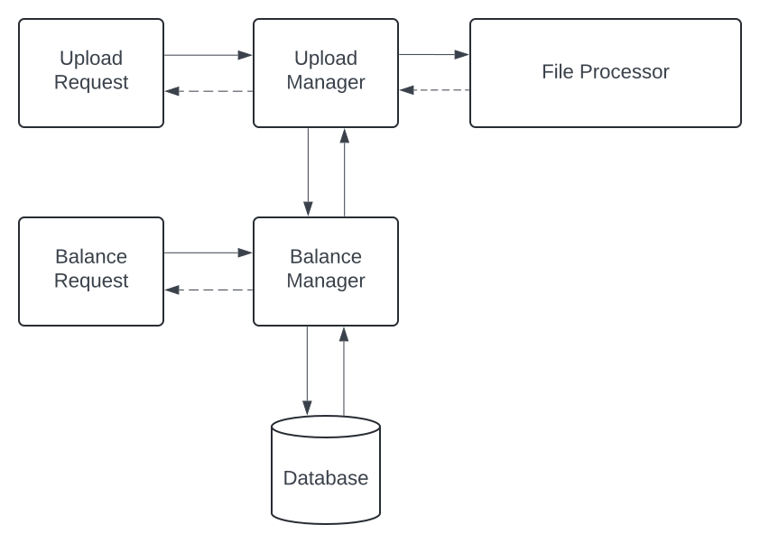

# Migration Service Design: File Upload Service
Este diseño cubre los aspectos del servicio de migracion historica de transacciones via archivo en formato de texto. Esta solucion no solamente esta enfocada en un solo tipo de archivo, sino pensada en forma abstracta para cualquier otro formato, haciendo enfasis en la performance.

### Requerimientos funcionales
- **Generacion de reporte de registros subidos**
  -  El servicio debe generar un reporte con un detalle de los registros que se subieron con exito
  -  El servicio debe generar un reporte con un detalle de los registros que fueron fallidos
- **Validacion de formato predeterminado**
  -  El archivo subido debe seguir ciertas reglas de formato
- **Servicio de consulta de balance**
  - El sistema debe exponer un servicio para la consulta de balance hacia un ID predeterminado
- **Manejo de errores en la obtencion de balance**
  - Se debe manejar correctamente los errores dado los casos en donde exista un formato invalido, usuario inexistente, etc.   
- **Filtrado de balance por rangos de fecha**
  - El servicio de obtencion de balance debe soportar un listado por rango de fechas 

### Requerimientos no funcionales
- **Formato de decimales**
  - Todos los numeros decimales expuestos en el reporte y via API deben utilizar `.`
- **Formato de la fecha**
  - El formato estandar de la fecha debe ser ISO 8601 `YYYY-MM-DDThh:mm:ss`
- **Restricciones de subida de archivo**
  - El archivo debe tener un tamaño maximo de 10MB 

### Fuera de scope
- **Autenticacion via API**
  - Se asume que la autenticacion de los servicios a exponer no forma parte del scope de desarrollo 
- **Notificacion del resultado del archivo**
  - El servicio no enviara el reporte que tiene la informacion de los registros subidos via Mail, sera devuelto via API en JSON. 

# Hight-Level Diagram

Este diagrama muestra a alto nivel los componentes del sistema junto a sus interacciones. No se incluyen detalles de implementacion.

---

1. **Upload Manager:**  
   - Es el encargado de utilizar la informacion procesada por el `File Processor` y tomar accion sobre la informacion que devuelve, tiene relacion directa con los demas componentes como el `Balance Manager` 
1. **File Processor**:
   - Se encarga de la gestion de la carga del archivo, tiene como objetivo la segmentacion del archivo con el fin de paralelizar la carga
3. **Balance Manager**:
   - Proporciona la logica necesaria para la gestion del balance de uno o varios usuarios, haciendo de nexo con la base de datos
